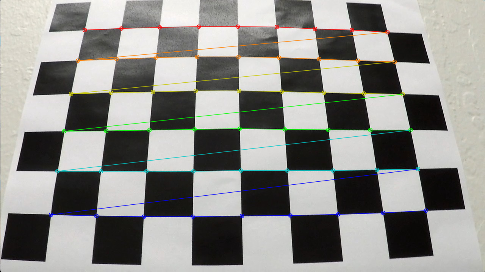
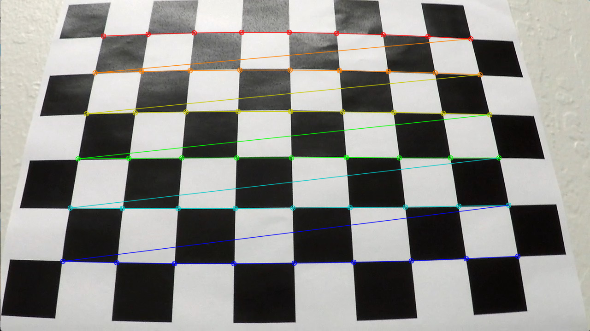
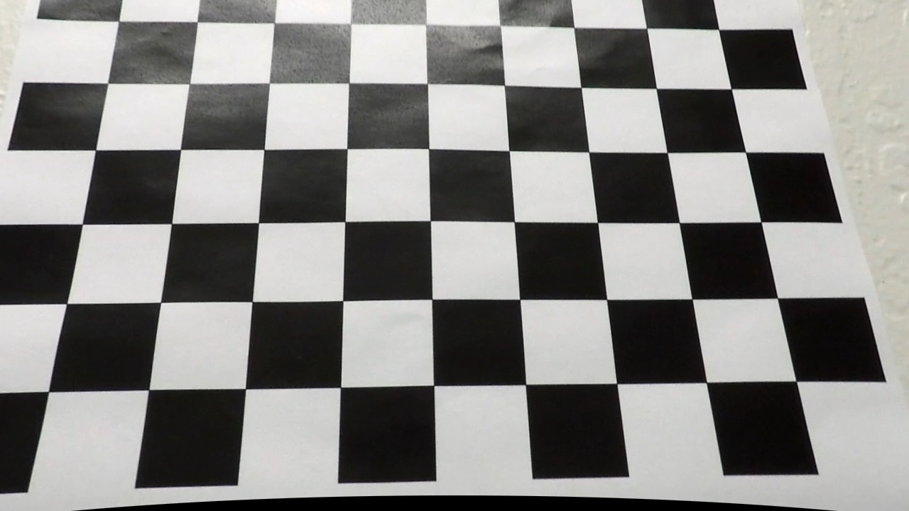
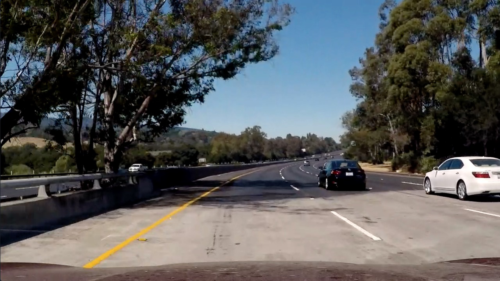
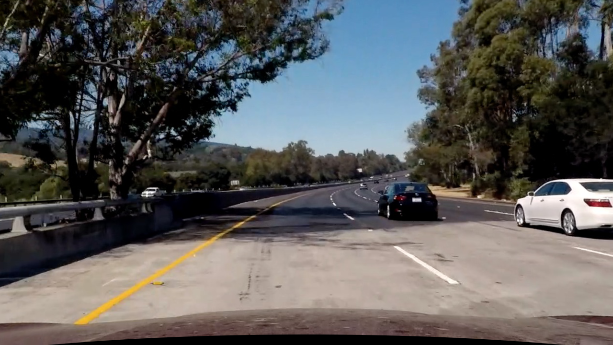
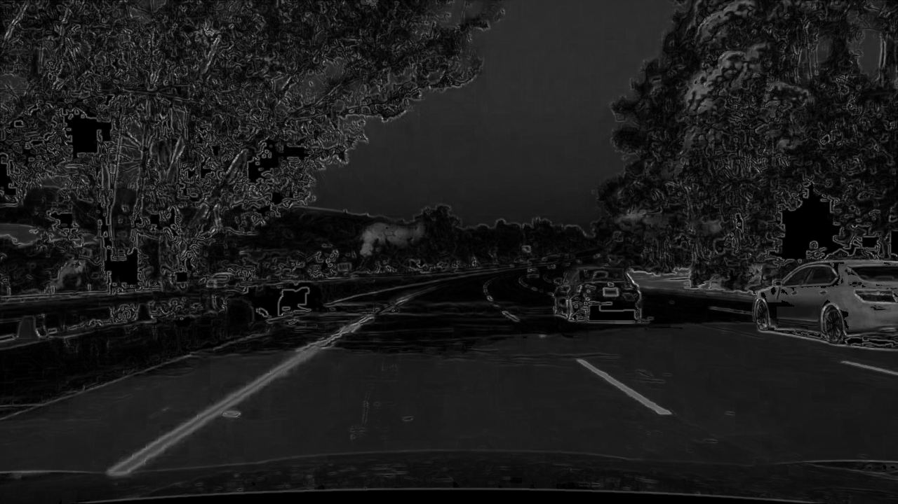
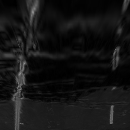
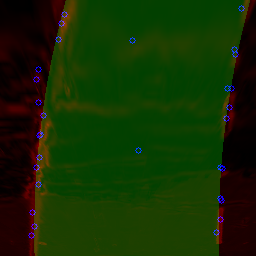
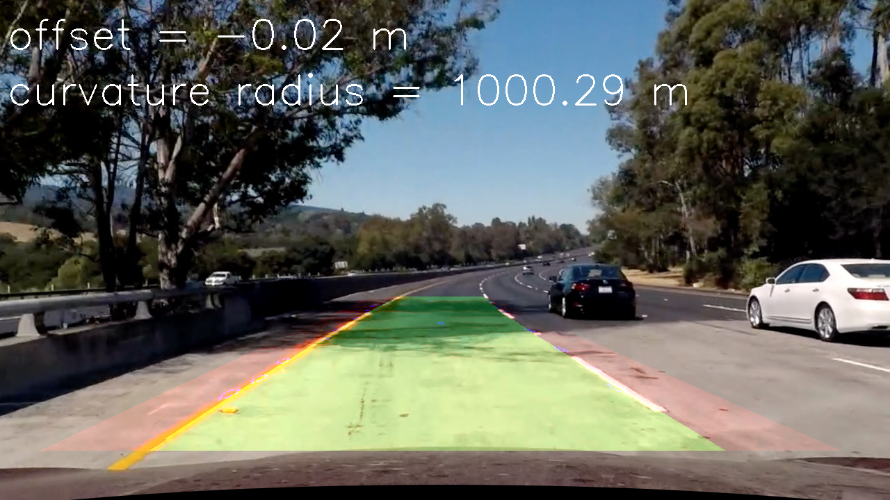

**Advanced Lane Finding Project**

The goals / steps of this project are the following:

* Compute the camera calibration matrix and distortion coefficients given a set of chessboard images.
* Apply a distortion correction to raw images.
* Use color transforms, gradients, etc., to create a thresholded binary image.
* Apply a perspective transform to rectify binary image ("birds-eye view").
* Detect lane pixels and fit to find the lane boundary.
* Determine the curvature of the lane and vehicle position with respect to center.
* Warp the detected lane boundaries back onto the original image.
* Output visual display of the lane boundaries and numerical estimation of lane curvature and vehicle position.

## [Rubric](https://review.udacity.com/#!/rubrics/571/view) Points

### Here I will consider the rubric points individually and describe how I addressed each point in my implementation.  

---

### Writeup / README

#### 1. Provide a Writeup that includes all the rubric points and how you addressed each one.  You can submit your writeup as markdown or pdf.  [Here](https://github.com/udacity/CarND-Advanced-Lane-Lines/blob/master/writeup_template.md) is a template writeup for this project you can use as a guide and a starting point.  

The project is here: [https://github.com/balintfodor/CarND-Advanced-Lane-Lines](https://github.com/balintfodor/CarND-Advanced-Lane-Lines)

The writeup is here: [https://github.com/balintfodor/CarND-Advanced-Lane-Lines/blob/master/writeup.md](https://github.com/balintfodor/CarND-Advanced-Lane-Lines/blob/master/writeup.md)

The video showing the final results can be found here: [https://youtu.be/bhCGGA5ezXY](https://youtu.be/bhCGGA5ezXY)

The video breaks down to the steps of the algorithm can be found here: [https://youtu.be/durShBo2A7A](https://youtu.be/durShBo2A7A)

The results of the test images can be found here: [https://github.com/balintfodor/CarND-Advanced-Lane-Lines/tree/master/output_images](https://github.com/balintfodor/CarND-Advanced-Lane-Lines/tree/master/output_images)

### Camera Calibration

#### 1. Briefly, state how you computed the camera matrix and distortion coefficients. Provide an example of a distortion corrected calibration image.

`calibrate.py` holds the code for the calibration. It takes a folder to search for images, tries to detect chessboards on the images, calibrates and saves the output to a numpy matrix file. I used `cv2.cornerSubPix` to refine the corner positions. The following images show the original image with chessboard detection (Fig1), the original image with reprojected chessboard coordinates (after calibration, using the calibration matrix) (Fig2) and the undistorted image (Fig3).

Fig1. Original

Fig2. Reprojected

Fig3. Undistorted

An example of the output of `calibrate.py`:

    camera matrix
    [[  1.15694047e+03   0.00000000e+00   6.65948820e+02]
     [  0.00000000e+00   1.15213880e+03   3.88784788e+02]
     [  0.00000000e+00   0.00000000e+00   1.00000000e+00]]
    distortion
    [[ -2.37638062e-01  -8.54041488e-02  -7.90999658e-04  -1.15882238e-04
        1.05725943e-01]]
    reprojection error for 17 images with size (1280, 720) with (9, 6) chessboard size is 0.8457746481608099
    calibration saved to debug/calibration.npz

The reprojection error 0.8458 compared to the size of the images seems ok.

### Pipeline (single images)

I used the python package `consecution` for assembling and configuring the pipeline. It is a simple, single-threaded, abstract pipeline implementation. This way I only had to implement the processing nodes. For every step of the algorithm, I implemented a class that represents one pipeline node. The code is in file `pipeline.py`.

The final assembly looks like:

    Undistort (1)
    | \
    |  LineScoreMap (2)
    |  PerspectiveWarp (3)
    |  LaneDetector (4)
    |  LanePainter (5)
    |  PerspectiveWarp (6)
    |  InfoPainter (7)
    | /
    Add (8)
    ImageLog (9)

I will discuss the node details by demonstrating example processing outputs. The original image I will show the steps on can be seen in Fig4.

Fig4. Original

#### 1. Provide an example of a distortion-corrected image.

Undistort node (1) loads the camera matrix and the distortion parameters and undistorts the input image using `cv2.remap` fed with the precomputed mapping parameters with `cv2.initUndistortRectifyMap`.

Fig5. Undistorted

#### 2. Describe how (and identify where in your code) you used color transforms, gradients or other methods to create a thresholded binary image.  Provide an example of a binary image result.

Instead of producing a binary map, node LineScoreMap (2) generates a grayscale image that combines information about the color and the gradients. LineScoreMap gives a score to every pixel. Higher scores should correspond to pixels part of a lane line.

First, the RGB image is converted to the HSV color space. The gradient magnitude and direction maps are calculated both for the S and the V channels.

I chose a target number for the direction value empirically. A direction score map is generated by measuring the pixel value distance from the target direction. This map is normalized to the range [0, 1] and multiplied by the corresponding gradient magnitude map (which is also normalized to [0, 1]) (`pipeline.py:72-81`).

I chose three HSV color values from the test images that match the color of the yellow line, a darker yellow line and the white line. For every selected HSV color a similarity map is generated (member function `color_score`). The L2 distance (in HSV space) of the pixel and the target color is cut at a maximal value, the image is normalized to [0, 1] and inversed. The color score map shows brighter values at colors close to the target color.

Finally, all the generated score maps are summed up, normalized to [0, 255] and converted to uint8 images.

Fig6. Score map

#### 3. Describe how (and identify where in your code) you performed a perspective transform and provide an example of a transformed image.

I picked 4 points laying on the lane lines forming a trapezoid manually from the images. These are the source points for the perspective transformation (`pipeline.py:326`). I map this trapezoid to a 256x256 image with the node PerspectiveWarp (3). I chose the dst point parameters so the mapping cuts the hood of the car.

Fig7. Perspective transformation

#### 4. Describe how (and identify where in your code) you identified lane-line pixels and fit their positions with a polynomial?

Class LaneDetector (4) is responsible for fitting a lane to the top-down viewed score map.

First, lane line candidate points are selected by separately analyzing both the left and right halves of the image. For a half image, a 128x16 (cols by rows) sub-images are cropped, marching from top to down with step size 16. In every sub-image, the position of the highest valued pixel is found. For this pixel and for its small surroundings the center of mass location is calculated. This location stands for the candidate in this sub-image. (`pipeline.py:148 select_points`)

Finally, we have 256/16 (rows / top-down step size) = 16 candidates for one half of the whole input image. The two sets of points (from the left and the right half) are merged.

A quadratic polynomial is fit to the candidate points with `scipy.optimize.least_squares`. I wanted to have similar characteristics for the two lane lines, so the two polynomial (for the lane side lines) share some parameters.

For the left lane line, the fitted curve is: `x = a*y*y + b*y + c`

For the right line: `x = a*y*y + b*y + d`

Note that the two curves differ only in the constant parameter. `scipy.optimize.least_squares` optimization is called with `'loss=soft_l1'` to give a more robust result. Most importantly, the function it minimizes is the following (slightly differs from `pipeline.py:165` to meet the simbolism introduced before):

    def f(a, b, c, d,  y, x, w):
        e1 = np.polyval([a, b, c], y) - x
        e2 = np.polyval([a, b, d], y) - x
        return np.sqrt(w) * np.minimum(np.abs(e1), np.abs(e2))

where `[a, b, c, d]` is the shared parameter vector, `(y, x)` is the sample point from the merged candidate point set and `w` is the weight for the sample. The function calculates the error for the first polynomial (`e1`), for the second polynomial (`e2`) and selects the one that is smaller, essentially saying that the current sample point is supporting the first OR the second polynomial. Choosing right initial parameters for the optimization can give good results. I also limited the maximal curvature by bounding parameter `a` to [-0.0015, 0.0015] which is an empirically selected constant.

Based on the y value of the candidate points a weight is added. The 'closer the candidate to the car', the larger weight it gets, since I think we can rely on the closer points more.

After there is a calculated polynomial pair, the fit residuals are calculated for every sample points. The points are sorted by its residuals increasingly and the lower half of the points are selected. These selected points are supposed to support our model more than the others. Finally, the selected points are stored to be used with halved weights in processing the next frame of the video. This way the estimated lanes are not independent from frame to frame.

Fig8. Lane fitting

#### 5. Describe how (and identify where in your code) you calculated the radius of curvature of the lane and the position of the vehicle with respect to center.

The calculated line parameters from LaneDetector (4) is sent to LanePainter (5) which visualize the lane. This visualization is sent onward to a back-warp node (PerspectiveWarp (6)) that maps the top-down view back to the road.

The lane parameters are also sent to the InfoPainter (7) node. This node calculates the car offset and road curvature radius parameters and writes these information on the image. The calculations use two ratio parameters: `k1=` lane width in meters per lane width in pixels, and `k2=` lane length in meters per lane length in pixels.

Car offset is measured by taking the midpoint of the two lane lines evaluated at y=255. Then the offset is the distance from the image midpoint (128). Finally multiplying with `k1`.

For the curvature radius measurement, first I sampled the two lines at several y positions. The generator (y) and the generated (x) points are scaled with `k1` and `k2`. Two quadratic polynomials are fit to the scaled datasets. Finally, the curvature for the quadratic is calculated at a fixed point.

#### 6. Provide an example image of your result plotted back down onto the road such that the lane area is identified clearly.

Fig9. Calculated values

---

### Pipeline (video)

#### 1. Provide a link to your final video output.  Your pipeline should perform reasonably well on the entire project video (wobbly lines are ok but no catastrophic failures that would cause the car to drive off the road!).

The video showing the final results can be found here: [https://youtu.be/bhCGGA5ezXY](https://youtu.be/bhCGGA5ezXY)

The video breaks down to the steps of the algorithm can be found here: [https://youtu.be/durShBo2A7A](https://youtu.be/durShBo2A7A)

---

### Discussion

#### 1. Briefly, discuss any problems / issues you faced in your implementation of this project.  Where will your pipeline likely fail?  What could you do to make it more robust?

The pipeline will probably fail with highly curved roads, visually occluded or hardly noticeable or missing lane lines. If the top-down view contains multiple lines per side (originating e.g. from shadows parallel to the lane lines) it will probably fail to detect the lane well.

It should be also noted that the first step (LineScoreMap) is somewhat slow in the algorithm.

A more robust road line segmentation could eliminate some of these problems.